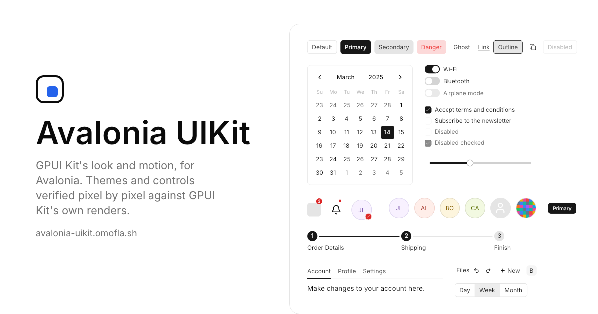

[](https://avalonia-uikit.omofla.sh)

# Avalonia UIKit

Avalonia themes and controls based on the Nova style of
[shadcn/ui](https://ui.shadcn.com) and on
[GPUI Kit](https://github.com/longbridge/gpui-kit).

**Documentation and live demos: [avalonia-uikit.omofla.sh](https://avalonia-uikit.omofla.sh)**

- `UIKitTheme` restyles Avalonia's own controls (Button, TextBox, ComboBox,
  Calendar, Tabs, Menus, ScrollViewer and 40 more) and adds controls for the
  GPUI Kit components and features Avalonia lacks: small components (Badge,
  Tag, Alert, Avatar, Stepper, Form and others), controls such as Select with
  search and multiple selection, ListView, Tree, CalendarView, DateField,
  Sidebar, Sheet and NotificationList, and attached properties such as a
  loading Button, input masks and tabs that close, reorder and drag out into
  windows. Optional packages cover `ColorPicker` and `DataGrid`, and the
  third-party library [Dock.Avalonia](https://github.com/wieslawsoltes/Dock)
  (docking layouts).
- Colors come in GPUI Kit's Default Light and Default Dark and in the 36 color
  themes GPUI Kit bundles (Aurora, Ayu, Catppuccin, Tokyo Night and others),
  chosen as theme variants (`UIKitThemeVariants`).
- Every theme and control is verified pixel by pixel, frame by frame, against
  renders of GPUI Kit itself (6,300+ automated cases, `docs/testing.md`).
- No reflection; NativeAOT and trimming are supported (except where a
  dependency is not trimmable: DataGrid, Dock.Avalonia).

## Packages

| Package | Contents | Version |
| --- | --- | --- |
| [AvaloniaUIKit](https://www.nuget.org/packages/AvaloniaUIKit) | `UIKitTheme` and the controls | [](https://www.nuget.org/packages/AvaloniaUIKit) |
| [AvaloniaUIKit.ColorPicker](https://www.nuget.org/packages/AvaloniaUIKit.ColorPicker) | The theme for Avalonia's `ColorPicker` | [](https://www.nuget.org/packages/AvaloniaUIKit.ColorPicker) |
| [AvaloniaUIKit.DataGrid](https://www.nuget.org/packages/AvaloniaUIKit.DataGrid) | The theme for Avalonia's `DataGrid` | [](https://www.nuget.org/packages/AvaloniaUIKit.DataGrid) |
| [AvaloniaUIKit.Dock](https://www.nuget.org/packages/AvaloniaUIKit.Dock) | The theme for Dock.Avalonia | [](https://www.nuget.org/packages/AvaloniaUIKit.Dock) |

```sh
dotnet add package AvaloniaUIKit
```

Then add `UIKitTheme` to the application's styles: see
[Installation](https://avalonia-uikit.omofla.sh/docs/installation).

## Repository

| Path | Contents |
| --- | --- |
| `src/` | The theme and controls (`AvaloniaUIKit`), `AvaloniaUIKit.ColorPicker`, `AvaloniaUIKit.DataGrid`, `AvaloniaUIKit.Dock` |
| `samples/` | A NativeAOT gallery, the site's demos, the preview renderer, the browser (WebAssembly) app and the control catalog |
| `sites/` | The documentation site (HonoX, Cloudflare Workers) — see `docs/site.md` |
| `tests/` | The comparison tests against GPUI Kit's reference renders, and the control catalog's tests |
| `docs/` | Design records (`docs/adr`), the testing guide, the compatibility list, the site, the control catalog and the releases |

## Building

```sh
scripts/verify.sh          # build and run every test
scripts/aot-smoke.sh       # publish the gallery with NativeAOT
```

The site's demos, previews and WebAssembly bundle are described in `docs/site.md`.

## Releasing

The four packages share one version (`<Version>` in `src/Directory.Build.props`).
The Version Bump workflow raises it and opens a pull request labeled `release`;
merging the pull request publishes the packages to nuget.org and creates the
GitHub release. See `docs/release.md`.

## Control catalog

```sh
dotnet run --project samples/AvaloniaUIKit.Demo.ControlCatalog
```

A desktop app with every demo of the site, live: pick a component in the
sidebar, read its demos' XAML, and change the demos' controls in a property
grid (style classes, properties, attached properties), which writes the changes
into the XAML shown. See `docs/control-catalog.md`.

## License

[MIT](LICENSE). The themes are ported from GPUI Kit (Apache-2.0) and draw
Lucide icons (ISC); [THIRD-PARTY-NOTICES.md](THIRD-PARTY-NOTICES.md) lists
these and the other third-party material, and ships in the NuGet packages.
